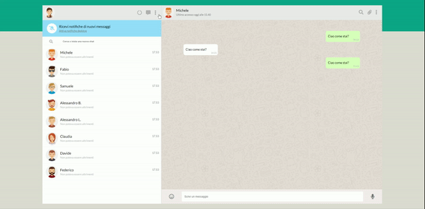

#   Boolzapp

> 

>

> ##### *:open_file_folder:  Project Name\:  js-html-css-boolzap :open_file_folder:*

>

> 

****Introduction:**** 

Interactive WhatsApp Web replica using HTML, CSS, and JavaScript.

### :computer: Languages and Libraries:

* HTML

* CSS

* JavaScript

* jQuery

### :desktop_computer: Preview:

> Visit my Github profile to see other projects

## :octocat: https://github.com/fabiogadau :octocat: ##
